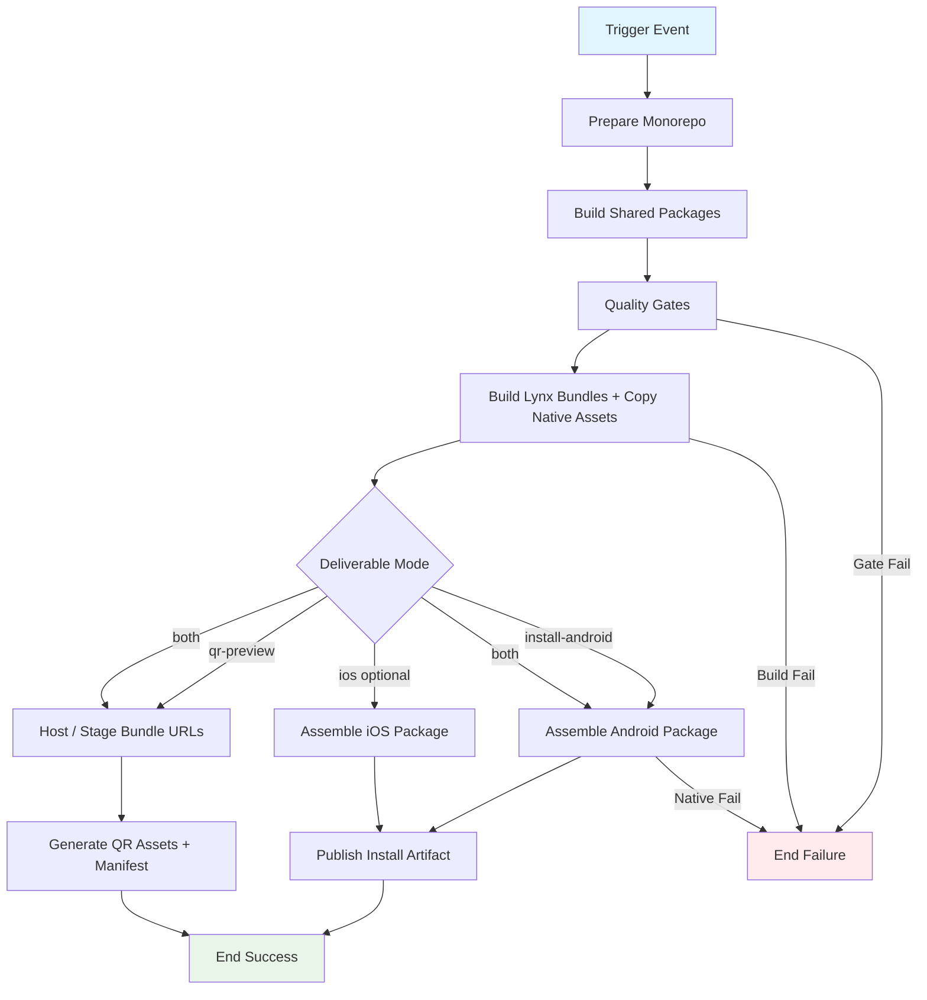

## Workflow Overview

**Purpose**: Build the Sparkling / ReactLynx app in `apps/frontend-app` and publish at least one consumable deliverable: a native **install package** (primary: Android) and/or a **scan-to-open QR** for LynxExplorer / scheme-based preview.
**Trigger Events**: Push to the default branch (path-filtered); pull request (validate + optional dry artifacts); manual dispatch with explicit deliverable mode.
**Target Environments**: CI artifact store (GitHub Actions Artifacts / Releases); optional public preview host for QR targets; device sideload / LynxExplorer scan.

## Execution Flow Diagram



## Jobs & Dependencies

| Job Name | Purpose | Dependencies | Execution Context |
|----------|---------|--------------|-------------------|
| prepare-lynx | Install deps, build workspace packages, run JS quality gates, produce `.lynx.bundle` set and copy into native asset paths | Trigger only | Linux CI runner; Node from repo pin |
| package-android | Produce installable Android package from bundled assets | prepare-lynx; when mode includes android | Linux runner with Android SDK / JDK |
| package-ios | Produce iOS archive / IPA (optional track) | prepare-lynx; when mode includes ios | macOS runner; Xcode matching project pin; signing material |
| publish-qr | Stage bundle URLs and emit QR image(s) + URL manifest | prepare-lynx; when mode includes qr | Any runner with network to preview host |
| publish-artifacts | Attach packages / QR assets to the workflow run (and optional Release) | package-* / publish-qr as selected | GitHub Actions artifact / release surface |

Jobs may be combined when a single runner can satisfy all selected modes; behavioral contracts below still apply.

## Requirements Matrix

### Functional Requirements

| ID | Requirement | Priority | Acceptance Criteria |
|----|-------------|----------|-------------------|
| REQ-001 | Build `frontend-app` from monorepo root context | High | Workspace packages resolve; Lynx page bundles exist for all configured entries (`main`, `second`, `home`, `room`, …) |
| REQ-002 | Build required shared packages before app build | High | `domain`, `validation`, `client-core`, `api-client` build successfully |
| REQ-003 | Copy Lynx outputs into native asset locations used by Sparkling | High | Android / iOS asset paths receive the built bundles before native packaging |
| REQ-004 | Support **install package** deliverable (Android MVP) | High | Downloadable debug (or signed release) APK is attached to the run |
| REQ-005 | Support **QR preview** deliverable | High | One QR image per published entry (or a documented single entry), plus a text manifest of scheme/URLs; scanning opens the intended Lynx / Explorer experience |
| REQ-006 | Manual mode selection | High | `workflow_dispatch` can choose `android` / `qr` / `both` / optional `ios` without a code change |
| REQ-007 | PR runs never publish public Releases by default | High | PRs may upload ephemeral CI artifacts; no GitHub Release mutation unless explicitly enabled later |
| REQ-008 | Fail closed on JS or native packaging errors for selected modes | High | Failed gates or packaging prevents declaring that mode successful |
| REQ-009 | Document API base URL behavior for device runs | Medium | Manifest / run summary states how the app resolves API origin (scheme/global props vs default localhost) |

### Security Requirements

| ID | Requirement | Implementation Constraint |
|----|-------------|---------------------------|
| SEC-001 | Signing secrets never appear in logs | Mask keystore passwords, certs, provisioning profiles |
| SEC-002 | Least-privilege permissions | Default `contents: read`; write only when creating Releases or Pages-hosted preview content |
| SEC-003 | Preview hosts must not expose private source | Only built bundles / QR images / URL lists are published |
| SEC-004 | Unsigned debug APKs labeled as non-production | Artifact naming / summary marks `debug` vs `release` |
| SEC-005 | iOS signing material stored as Environment secrets | Not committed; environment optional approval for release IPA |

### Performance Requirements

| ID | Metric | Target | Measurement Method |
|----|-------|--------|-------------------|
| PERF-001 | Lynx + Android debug package path | ≤ 25 minutes typical | Workflow duration |
| PERF-002 | QR-only path (bundles + QR, no native) | ≤ 15 minutes typical | Workflow duration |
| PERF-003 | Dependency install | Prefer lockfile cache hit | Cache hit rate in logs |
| PERF-004 | iOS path (when enabled) | ≤ 45 minutes typical | macOS job duration |

## Input/Output Contracts

### Inputs

```yaml
# Dispatch / mode
deliverable_mode: enum  # android | qr | both | ios | all
                        # Purpose: select which consumable outputs to produce

# Preview / QR
PREVIEW_BASE_URL: string     # Purpose: public origin that serves .lynx.bundle (or Explorer-compatible URLs)
QR_SCHEMA_TEMPLATE: string   # Purpose: how bundle URL is wrapped for scanners (e.g. Explorer fullscreen query)
QR_ENTRIES: string[]         # Purpose: which page entries get QR codes; default all app entries

# Android packaging
ANDROID_BUILD_TYPE: enum     # debug | release
ANDROID_KEYSTORE: secret     # Purpose: release signing (required only for release)

# iOS packaging (optional track)
IOS_SIGNING_IDENTITY: secret
IOS_PROVISIONING_PROFILE: secret
IOS_TEAM_ID: string

# Repository Triggers
paths:
  - apps/frontend-app/**
  - packages/domain/**
  - packages/validation/**
  - packages/client-core/**
  - packages/api-client/**
  - package-lock.json
  - package.json
  - .github/workflows/<this-workflow>/**
branches:
  - <default-branch>
events:
  - push
  - pull_request
  - workflow_dispatch
```

### Outputs

```yaml
# Lynx
lynx_bundles: directory          # Description: *.lynx.bundle (+ static assets)

# Install packages
android_apk: file                # Description: installable APK (debug or release)
ios_ipa_or_app: file             # Description: optional; when ios mode enabled

# QR preview
qr_images: file[]                # Description: PNG/SVG QR per entry
qr_manifest: file                # Description: entry → URL/scheme mapping (machine + human readable)
preview_urls: string[]           # Description: absolute URLs encoded into QR codes

# Run metadata
artifact_summary: string         # Description: modes succeeded, artifact names, expiry note
```

### Secrets & Variables

| Type | Name | Purpose | Scope |
|------|------|---------|-------|
| Variable | `PREVIEW_BASE_URL` | Public base for QR target URLs | Repository or Environment |
| Variable | `QR_SCHEMA_TEMPLATE` / documented default | Scheme wrapping for LynxExplorer | Repository |
| Variable | `ANDROID_BUILD_TYPE` | debug (default) vs release | Repository / dispatch input |
| Secret | Android keystore + passwords | Release APK signing | Environment `mobile-release` |
| Secret | Apple signing + profiles | IPA / archive | Environment `mobile-release` |
| — | API base URL | Not baked by default; device uses scheme/global props (`apiBaseUrl`) or localhost default | Document in QR/install notes |

## Execution Constraints

### Runtime Constraints

- **Timeout**: Lynx+Android ≤ 30 minutes; QR-only ≤ 20 minutes; iOS-inclusive ≤ 60 minutes
- **Concurrency**: One packaging group per branch/mode; cancel or queue stale runs
- **Resource Limits**: Android SDK + JDK on Linux; Xcode on macOS for iOS track

### Environmental Constraints

- **Runner Requirements**:
  - Shared JS/Lynx build: Linux; Node major matching repo pin; npm workspaces + lockfile
  - Android package: Android SDK platform-tools / build-tools compatible with the project Gradle setup
  - iOS package: macOS; Xcode version aligned with `apps/frontend-app` Xcode pin; CocoaPods / Bundler as required by the iOS project
- **Network Access**: npm registry; optional preview upload host; Apple/Google not required for debug APK
- **Permissions**: read source; write artifacts; optional `contents: write` only for Releases
- **Working Directory**: Install and package builds from repository / app paths so workspaces and Sparkling paths resolve
- **Device install in CI**: Not required; packaging must succeed headless (no emulator/device assumed)

### Application Constraints (product)

- App is Sparkling brownfield: Lynx JS bundles + native Android/iOS shells
- Local QR plugin behavior (dev server TTY) is **not** the CI contract; CI must emit durable QR image files and URL manifest
- Hybrid scheme / Explorer fullscreen query conventions must remain compatible with existing app routing
- API client defaults to localhost; real-device testing requires passing `apiBaseUrl` (or equivalent) via scheme/global props — workflow summary must remind operators

## Error Handling Strategy

| Error Type | Response | Recovery Action |
|------------|----------|-----------------|
| Dependency / package build failure | Fail before Lynx build | Fix lockfile / packages; re-run |
| Lynx bundle build failure | Fail all selected modes | Fix rspeedy/ReactLynx errors; re-run |
| Asset copy into native paths failure | Fail native packaging modes | Fix Sparkling paths / `--copy` contract; re-run |
| Android assemble failure | Fail android mode; QR mode may still succeed if selected independently in a matrix | Fix Gradle/SDK; re-run android |
| Preview host upload failure | Fail qr mode | Fix credentials / base URL; re-run qr |
| QR generation with empty URL | Fail qr mode | Require `PREVIEW_BASE_URL` (or equivalent) for qr/both |
| iOS signing failure | Fail ios mode only | Fix certs/profiles; re-run ios |
| Partial matrix success | Report per-mode status; do not mark overall success if any **selected** mode failed | Re-run failed mode |

## Quality Gates

### Gate Definitions

| Gate | Criteria | Bypass Conditions |
|------|----------|-------------------|
| Unit Tests | `frontend-app` test suite passes | None for default-branch packaging |
| Lynx Production Build | All configured entries emit bundles with zero errors | None |
| Native Asset Sync | Bundles present in configured Android/iOS asset dirs before package jobs | QR-only mode may skip native copy if bundles are hosted directly from `dist/` |
| Android Package | Selected build type produces a non-empty APK | Mode not selected |
| QR Integrity | Each selected entry has a QR file + resolvable URL in the manifest | Mode not selected |
| iOS Package | Selected iOS artifact produced and signed per policy | Mode not selected / track disabled |

## Monitoring & Observability

### Key Metrics

- **Success Rate**: ≥ 90% for android+lynx path; ≥ 95% for qr-only path (rolling 30 days)
- **Execution Time**: p50 / p95 by mode
- **Artifact Size**: APK size and total `.lynx.bundle` size trend

### Alerting

| Condition | Severity | Notification Target |
|-----------|----------|---------------------|
| Default-branch packaging failure | High | Maintainers (failed-run notification) |
| QR published but URL 404 | High | Maintainers + preview host owners |
| APK size jump > 2× baseline | Medium | Maintainers |
| iOS signing expired | High | Maintainers (before next ios run) |

## Integration Points

### External Systems

| System | Integration Type | Data Exchange | SLA Requirements |
|--------|------------------|---------------|------------------|
| GitHub Actions | CI runtime | Logs, artifacts | Platform SLA |
| GitHub Artifacts / Releases | Distribution | APK, IPA, QR images, manifests | Artifact retention per repo settings |
| Preview static host (optional) | Bundle hosting for QR | Upload `.lynx.bundle` / static assets | Must be reachable by phones on same network policy |
| LynxExplorer / Sparkling client | Scan target | Scheme URL from QR | Client version compatible with bundles |
| Backend API | Runtime dependency of app | Device HTTP to API origin | Independent of this workflow |
| Android SDK / Xcode | Native build toolchains | Compile/link | Local runner image currency |

### Dependent Workflows

| Workflow | Relationship | Trigger Mechanism |
|----------|--------------|-------------------|
| Frontend-web GitHub Pages | Soft: may host preview bundles for QR if chosen as `PREVIEW_BASE_URL` | Independent; coordinate URL layout |
| Backend deploy (e.g. Vercel) | Soft: device API origin for real testing | Operators pass `apiBaseUrl` into scheme when scanning/installing |

## Compliance & Governance

### Audit Requirements

- **Execution Logs**: Retained per GitHub retention
- **Approval Gates**: Optional environment reviewers for release-signed packages
- **Change Control**: Update this specification before changing deliverable modes, signing policy, or QR URL scheme

### Security Controls

- **Access Control**: Artifact download follows repo visibility; Releases follow publish permissions
- **Secret Management**: Mobile signing secrets rotate via Environment; debug APK path avoids signing secrets
- **Vulnerability Scanning**: Out of scope for v1 (may add dependency / APK scan later)

## Edge Cases & Exceptions

### Scenario Matrix

| Scenario | Expected Behavior | Validation Method |
|----------|-------------------|-------------------|
| PR with only Lynx source changes | Gates + Lynx build; ephemeral artifacts OK; no Release | Check run artifacts / no Release |
| `deliverable_mode=qr` without preview base | Fail closed with clear error | Failed step message |
| `deliverable_mode=android` without device | Still produces APK artifact | Download and `adb install` locally |
| QR scanned off-VPN while preview host is private | Scan “works” but content fails to load | Document network requirement in manifest |
| App opened without `apiBaseUrl` | Client falls back to localhost (likely wrong on device) | Summary checklist includes API reminder |
| iOS mode on Linux-only org runners | Job skipped or fails with “macOS required” | Explicit skip/fail reason |
| Concurrent pushes | One active concurrency group wins | Latest artifacts retained |
| Entry list changes in `app.config` | QR/manifest covers new entries or documents subset | Manifest entry count matches selection |

## Validation Criteria

### Workflow Validation

- **VLD-001**: Default-branch run with android mode attaches a sideloadable APK
- **VLD-002**: QR mode attaches QR image(s) + manifest; scanning opens the intended entry in Explorer / host app
- **VLD-003**: Selected mode failures fail the workflow (or the selected matrix leg) without silent success
- **VLD-004**: PR does not create a GitHub Release by default
- **VLD-005**: Lynx bundles for configured pages are present before native packaging
- **VLD-006**: Manual dispatch can produce `android`, `qr`, or `both` without new commits

### Performance Benchmarks

- **PERF-001**: Android+Lynx cold path within android timeout
- **PERF-002**: QR-only warm path typically within 15 minutes

## Change Management

### Update Process

1. **Specification Update**: Modify this document first
2. **Review & Approval**: Maintainer review for mode, signing, and QR scheme changes
3. **Implementation**: Apply equivalent workflow / hosting layout changes
4. **Testing**: PR dry-run for gates; dispatch for artifact/QR validation on a device
5. **Deployment**: Merge; confirm artifact download and (if enabled) QR scan on a phone

### Version History

| Version | Date | Changes | Author |
|---------|------|---------|--------|
| 1.0 | 2026-09-14 | Initial specification: Lynx build → Android install package and/or QR preview | heyongqi10 |

## Related Specifications

- App workspace: `apps/frontend-app` (Sparkling + ReactLynx; `sparkling-app-cli` build/copy; Android `assembleDebug` path; QR plugin for local dev only)
- Monorepo workspaces: root npm workspaces (`apps/*`, `packages/*`)
- Frontend-web Pages (optional preview host): `spec/spec-process-cicd-frontend-web-github-pages.md`
- Backend API hosting coordination: `.trellis/tasks/09-14-backend-vercel-deploy/`
- Frontend-app coding specs: `.trellis/spec/frontend-app/frontend/index.md`
