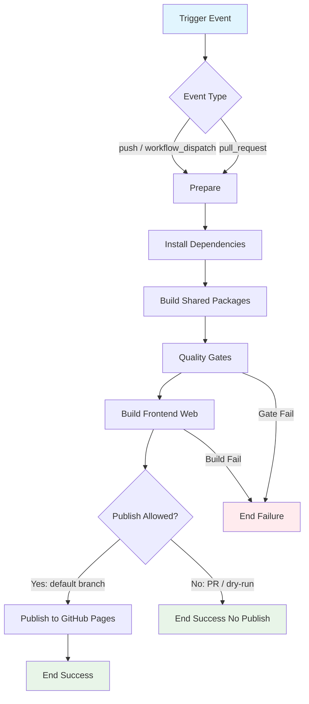

## Workflow Overview

**Purpose**: Build the Vue SPA in `apps/frontend-web` (with monorepo workspace packages) and publish the static artifacts to GitHub Pages.
**Trigger Events**: Push to the default branch; manual dispatch; optional pull-request validation (build-only, no publish).
**Target Environments**: GitHub Pages production site for this repository (project or user/org Pages site).

## Execution Flow Diagram



## Jobs & Dependencies

| Job Name | Purpose | Dependencies | Execution Context |
|----------|---------|--------------|-------------------|
| prepare-and-build | Install workspace deps, build shared packages, run quality gates, produce static site | Trigger only | Linux CI runner; Node from repo pin |
| deploy-pages | Publish build artifact to GitHub Pages | prepare-and-build; default-branch / manual only | GitHub Pages deploy environment |

Jobs may be merged into one if the platform requires a single Pages deploy job; behavior and gates below still apply.

## Requirements Matrix

### Functional Requirements

| ID | Requirement | Priority | Acceptance Criteria |
|----|-------------|----------|-------------------|
| REQ-001 | Build `frontend-web` from monorepo root context | High | Shared packages resolve; production static output exists under the app build directory |
| REQ-002 | Build workspace packages required by `frontend-web` before the app build | High | `domain`, `validation`, `client-core`, `api-client` (and any declared transitive workspace deps) are built successfully |
| REQ-003 | Publish only from an approved source | High | Publish runs on default-branch push or explicit manual dispatch; PR runs never publish |
| REQ-004 | Serve correctly under the Pages site base path | High | Asset URLs and client router history use the configured site base; deep links do not 404 on refresh (SPA fallback) |
| REQ-005 | Inject production API base URL at build time | High | Built client calls the configured backend origin via `VITE_API_BASE_URL` (or equivalent documented build-time input) |
| REQ-006 | Support manual re-deploy without code change | Medium | `workflow_dispatch` produces the same publish path as default-branch push |
| REQ-007 | Fail closed on quality or build errors | High | Failed lint / type-check / unit tests (if gated) or build prevents publish |

### Security Requirements

| ID | Requirement | Implementation Constraint |
|----|-------------|---------------------------|
| SEC-001 | Secrets never appear in logs or artifacts | Mask API URLs if sensitive; never echo tokens |
| SEC-002 | Least-privilege workflow permissions | Read contents for build; write only Pages + id-token as needed for Pages deploy |
| SEC-003 | Deploy environment protection optional | Production Pages environment may require reviewers when enabled in repo settings |
| SEC-004 | No commit of `.env*` or local secrets into the workflow tree | Build-time config comes from repository Variables / Secrets or explicit dispatch inputs |

### Performance Requirements

| ID | Metric | Target | Measurement Method |
|----|-------|--------|-------------------|
| PERF-001 | End-to-end workflow duration | ≤ 15 minutes typical | Workflow run duration metric |
| PERF-002 | Dependency install time | Prefer cache hit on lockfile | Compare install step with/without cache |
| PERF-003 | Artifact size | Track Pages upload size; alert on sudden large growth | Pages artifact / deploy size in run summary |

## Input/Output Contracts

### Inputs

```yaml
# Build-time configuration
VITE_API_BASE_URL: string  # Purpose: backend origin used by the SPA API client
PAGES_BASE_PATH: string    # Purpose: public asset/router base for the Pages URL shape
                           # e.g. "/" for custom domain or user site; "/<repo>/" for project site

# Repository Triggers
paths:
  - apps/frontend-web/**
  - packages/domain/**
  - packages/validation/**
  - packages/client-core/**
  - packages/api-client/**
  - package-lock.json
  - package.json
  - .github/workflows/<this-workflow>/**
branches:
  - <default-branch>
events:
  - push
  - pull_request   # build + gates only
  - workflow_dispatch
```

### Outputs

```yaml
# Job Outputs
static_site_artifact: directory  # Description: production Vite build output (HTML/JS/CSS/assets)
pages_url: string                # Description: published GitHub Pages site URL
build_status: enum               # Description: success | failure
```

### Secrets & Variables

| Type | Name | Purpose | Scope |
|------|------|---------|-------|
| Variable | `VITE_API_BASE_URL` | Production/staging API origin baked into the SPA | Repository or Environment |
| Variable | `PAGES_BASE_PATH` | Vite/`BASE_URL` base for GitHub Pages path | Repository or Environment |
| Secret | (none required for public Pages) | — | — |
| Secret | `API`-related (optional) | Only if build needs non-public config beyond API origin | Environment |

GitHub-provided `GITHUB_TOKEN` (or Pages OIDC) is used for artifact upload / Pages deploy; no third-party host token required.

## Execution Constraints

### Runtime Constraints

- **Timeout**: ≤ 20 minutes per workflow run
- **Concurrency**: One in-flight Pages deploy per branch/environment; newer run cancels or queues older deploy of the same group
- **Resource Limits**: Standard GitHub-hosted runner; no privileged containers required

### Environmental Constraints

- **Runner Requirements**: Linux x64; Node major matching repo pin (nvm / engines alignment for this monorepo)
- **Package Manager**: npm workspaces + lockfile only (no alternate package managers)
- **Network Access**: Registry for dependency install; GitHub Pages publish endpoints
- **Permissions**: `contents: read`; `pages: write`; `id-token: write` when using official Pages deploy path
- **Working Directory Model**: Install and build from repository root so workspaces resolve

### Application Constraints (product)

- SPA uses HTML5 history mode keyed off build `BASE_URL`; Pages must provide SPA fallback to `index.html`
- Client depends on remote HTTP API; static host does not proxy `/api` (dev proxy is local-only)
- In-memory / multi-instance backend limitations are out of scope for this workflow; workflow only publishes the frontend

## Error Handling Strategy

| Error Type | Response | Recovery Action |
|------------|----------|-----------------|
| Dependency install failure | Fail workflow; no publish | Fix lockfile / registry; re-run |
| Shared package build failure | Fail before app build | Fix package compile errors; re-run |
| Lint / type-check / unit test failure | Fail workflow; no publish | Fix code; re-run |
| App build failure | Fail workflow; no publish | Fix Vite/Vue build; verify `BASE_URL` / env |
| Pages publish failure | Fail deploy job; retain build logs | Check Pages settings, permissions, concurrency; re-run dispatch |
| Partial / cancelled concurrency | Suppress stale deploy | Allow winning run to publish |

## Quality Gates

### Gate Definitions

| Gate | Criteria | Bypass Conditions |
|------|----------|-------------------|
| Type Check | `frontend-web` type-check passes | None on default-branch publish |
| Lint | Workspace lint for changed frontend scope passes | None on default-branch publish |
| Unit Tests | `frontend-web` unit suite passes (non-watch) | Documented emergency `workflow_dispatch` input only if explicitly added later |
| Production Build | Static build completes with zero errors | None |
| Base Path Sanity | Built `index.html` asset paths respect configured base | None |

## Monitoring & Observability

### Key Metrics

- **Success Rate**: ≥ 95% of default-branch deploys over rolling 30 days
- **Execution Time**: p50 / p95 duration from workflow summary
- **Resource Usage**: Dependency cache hit rate; artifact size trend

### Alerting

| Condition | Severity | Notification Target |
|-----------|----------|---------------------|
| Default-branch deploy failure | High | Repo maintainers (GitHub failed-run notification) |
| Repeated Pages publish failures (≥3 consecutive) | High | Maintainers + check Pages / permissions settings |
| Artifact size jump > 2× baseline | Medium | Maintainers |

## Integration Points

### External Systems

| System | Integration Type | Data Exchange | SLA Requirements |
|--------|------------------|---------------|------------------|
| GitHub Actions | CI runtime | Source checkout, logs, artifacts | GitHub platform SLA |
| GitHub Pages | Static hosting | Upload built site; serve public HTTPS | Pages propagation typically minutes |
| Backend API | Runtime dependency of SPA | Browser calls using baked `VITE_API_BASE_URL` | Backend availability independent of this workflow |
| npm registry | Build dependency | Package tarballs | Required for cold installs |

### Dependent Workflows

| Workflow | Relationship | Trigger Mechanism |
|----------|--------------|-------------------|
| Backend deploy (e.g. Vercel) | Soft dependency: SPA needs a reachable API URL | Independent; coordinate variable updates when API origin changes |
| Future monorepo CI (lint/test-all) | May share gates | Optional reuse; this workflow remains publish-authoritative for Pages |

## Compliance & Governance

### Audit Requirements

- **Execution Logs**: Retained per GitHub org/repo retention settings
- **Approval Gates**: Optional environment reviewers for production Pages
- **Change Control**: Update this specification before changing publish triggers, base path rules, or gated checks

### Security Controls

- **Access Control**: Only actors who can push to default branch or run `workflow_dispatch` with permission can publish
- **Secret Management**: Prefer Variables for non-secret API origin; rotate any future secrets via GitHub Environments
- **Vulnerability Scanning**: Out of scope for v1; may add dependency audit gate later without changing publish contract

## Edge Cases & Exceptions

### Scenario Matrix

| Scenario | Expected Behavior | Validation Method |
|----------|-------------------|-------------------|
| Project site at `/<repo>/` | Assets and router use `/<repo>/` base; refresh on nested routes works | Open nested route; hard refresh |
| Custom domain at `/` | Base is `/`; same SPA fallback | Hard refresh on nested route |
| PR opened touching only backend | Workflow may skip via path filters | No run, or no-op |
| PR touching `frontend-web` | Build + gates run; Pages not updated | Artifact optional; site URL unchanged |
| `VITE_API_BASE_URL` missing | Fail build or fail gate (explicit); do not publish a broken client | Inspect failed logs |
| Concurrent pushes to default branch | Single active deploy group; one publisher wins | Only latest site content remains |
| Lockfile out of sync | Install fails; no publish | Re-generate lockfile locally with pinned Node/npm |

## Validation Criteria

### Workflow Validation

- **VLD-001**: Default-branch push that changes `apps/frontend-web/**` or required packages results in an updated Pages site
- **VLD-002**: Pull requests never mutate the live Pages site
- **VLD-003**: Published site loads over HTTPS at the expected Pages URL
- **VLD-004**: Client issues API requests to the configured backend origin (not localhost)
- **VLD-005**: Nested client routes survive refresh (SPA fallback + correct base)
- **VLD-006**: Manual dispatch can republish without a new commit

### Performance Benchmarks

- **PERF-001**: Cold run completes within timeout (20 minutes)
- **PERF-002**: Warm (cached) run typically ≤ 15 minutes

## Change Management

### Update Process

1. **Specification Update**: Modify this document first
2. **Review & Approval**: Maintainer review of trigger, permissions, and base-path changes
3. **Implementation**: Apply equivalent changes to the GitHub Actions workflow definition
4. **Testing**: Validate on a branch via PR build; then default-branch or dispatch publish
5. **Deployment**: Merge workflow changes; confirm Pages URL and SPA routing

### Version History

| Version | Date | Changes | Author |
|---------|------|---------|--------|
| 1.0 | 2026-09-14 | Initial specification for `frontend-web` → GitHub Pages | heyongqi10 |

## Related Specifications

- App build/runtime: `apps/frontend-web` (Vue 3 + Vite SPA; `VITE_API_BASE_URL`; history router + `BASE_URL`)
- Monorepo workspace: root npm workspaces (`apps/*`, `packages/*`)
- Backend hosting (API origin coordination): `.trellis/tasks/09-14-backend-vercel-deploy/` design/PRD when API is on Vercel
- Frontend-web coding specs: `.trellis/spec/frontend-web/frontend/index.md`
