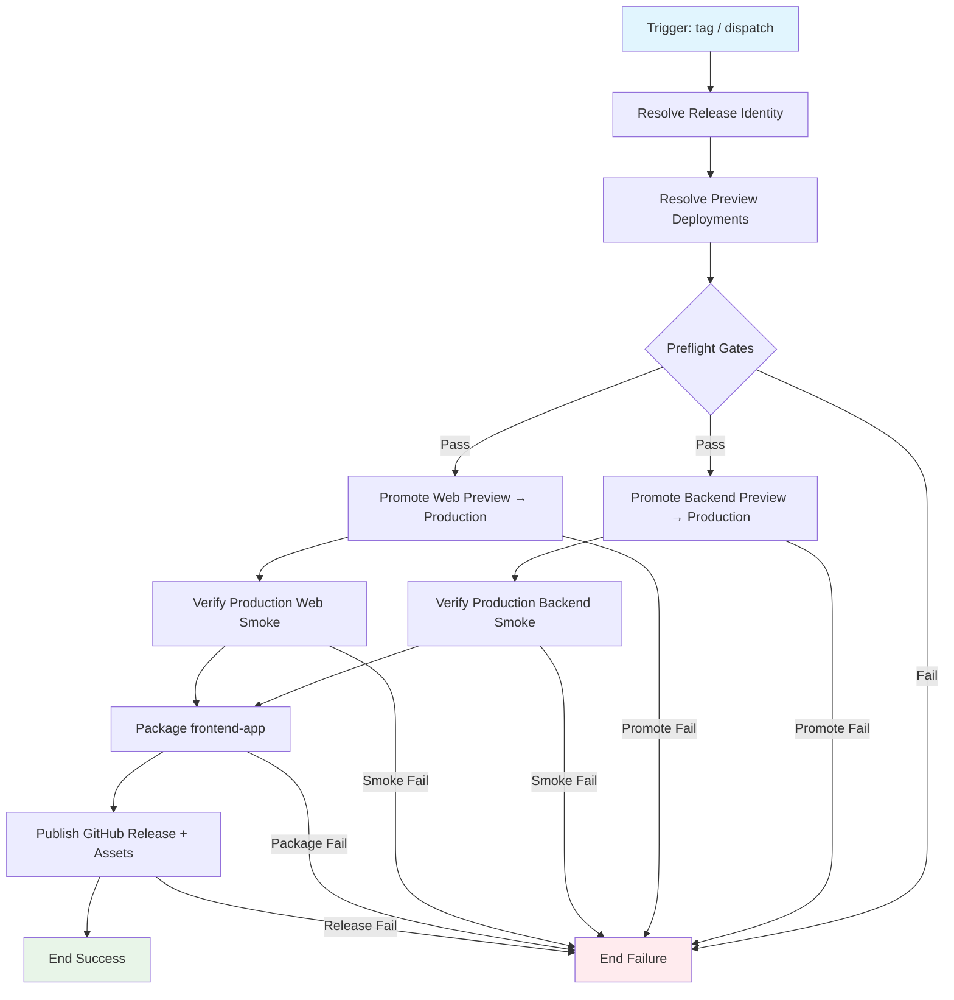

## Workflow Overview

**Purpose**: Cut a production release by promoting Ready Vercel **preview** deployments of `frontend-web` and `backend` to **Production**, packaging `frontend-app` install/QR deliverables against the production API origin, and publishing a versioned **GitHub Release** with those artifacts and release notes.
**Trigger Events**: Semver-like git tag push (`v[0-9]*`, e.g. `v1.2.3`); manual `workflow_dispatch` with explicit version / optional deployment selectors.
**Target Environments**: Vercel Production for projects `lejv-party-frontend-web` and `lejv-party-backend` (team `clawd-cook`); GitHub Releases for app packages / notes; device sideload / LynxExplorer for app artifacts.

## Execution Flow Diagram



Promote jobs for web and backend may run in parallel after shared resolve/preflight; packaging and GitHub Release wait until **both** production promotions (and smoke checks) succeed.

## Jobs & Dependencies

| Job Name | Purpose | Dependencies | Execution Context |
|----------|---------|--------------|-------------------|
| resolve-release | Parse version/tag, commit SHA, changelog inputs; normalize Release identity | Trigger only | Linux runner |
| resolve-previews | Select Ready preview deployment per Vercel project (by SHA, URL input, or “latest Ready on commit”) | resolve-release | Linux; Vercel API/CLI auth |
| promote-backend | Promote selected backend preview → Production alias/domain | resolve-previews + gates | Linux; Vercel token; Environment `production` |
| promote-web | Promote selected frontend-web preview → Production | resolve-previews + gates | Linux; Vercel token; Environment `production` |
| smoke-production | HTTP smoke against production origins (backend `/api`, web root) | promote-backend / promote-web | Linux; public HTTPS |
| package-app | Build Lynx bundles + Android (and optional QR) for release assets | smoke-production (or both promotes if smoke optional-skipped by policy) | Linux; Node pin; Android SDK when APK required |
| publish-github-release | Create/update GitHub Release for the version tag; attach app artifacts + summary | package-app | `contents: write`; GitHub Releases API |

Jobs may be merged when runner constraints allow; behavioral contracts below still apply.

## Requirements Matrix

### Functional Requirements

| ID | Requirement | Priority | Acceptance Criteria |
|----|-------------|----------|-------------------|
| REQ-001 | Promote **existing** Ready preview → Production for backend | High | Production traffic for `lejv-party-backend` serves the selected preview build; custom domain / production URL remains the public API origin |
| REQ-002 | Promote **existing** Ready preview → Production for frontend-web | High | Production traffic for `lejv-party-frontend-web` serves the selected preview build; SPA loads over HTTPS |
| REQ-003 | Do not invent a new production build as the default path | High | Default path is promote-of-preview; full `--prod` rebuild only if explicitly selected as a documented fallback mode |
| REQ-004 | Preview selection is deterministic | High | Selection rules documented: prefer deployment matching release commit SHA; else dispatch-provided deployment URL/ID; else fail closed (no silent “latest unrelated preview”) |
| REQ-005 | Both Vercel promotions succeed before Release publish | High | GitHub Release is not marked published if either promote or required smoke fails |
| REQ-006 | Package `frontend-app` for the release | High | At least Android install package (debug labeled or signed release per policy) and Lynx bundles attached; QR optional via input |
| REQ-007 | Publish a versioned GitHub Release | High | Tag exists; Release body includes version, commit SHA, promoted Vercel deployment IDs/URLs, production origins, artifact list |
| REQ-008 | Manual re-release / dry-run controls | Medium | Dispatch can target version; optional `dry_run` skips promote + Release mutate; optional skip-app or skip-promote flags for recovery |
| REQ-009 | Production API origin consistency | High | Release notes and app packaging reference canonical backend production origin (see room/API contract); web already baked against that origin in production builds |
| REQ-010 | Idempotent re-run on same tag | Medium | Re-running promote of the same deployment is safe; Release update attaches/replaces assets without creating a duplicate tag |

### Security Requirements

| ID | Requirement | Implementation Constraint |
|----|-------------|---------------------------|
| SEC-001 | Vercel credentials never appear in logs | Token via GitHub Secrets / Environment; masked |
| SEC-002 | Production Environment protection | `production` (or equivalent) Environment may require reviewers before promote steps |
| SEC-003 | Least-privilege permissions | Default read; write only for Release assets and any required OIDC; no broad org admin |
| SEC-004 | No promotion of non-Ready or foreign deployments | Reject Building/Error/Canceled; reject deployments not belonging to the two named projects |
| SEC-005 | Signing secrets for release APK (if used) | Environment secrets only; debug APK must be labeled non-store |

### Performance Requirements

| ID | Metric | Target | Measurement Method |
|----|-------|--------|-------------------|
| PERF-001 | Promote + smoke (both projects) | ≤ 10 minutes typical | Job duration |
| PERF-002 | App package (Lynx + Android) | ≤ 30 minutes typical | Job duration |
| PERF-003 | End-to-end release workflow | ≤ 45 minutes typical | Workflow duration |
| PERF-004 | GitHub Release publish | ≤ 2 minutes after artifacts ready | Step duration |

## Input/Output Contracts

### Inputs

```yaml
# Release identity
version: string              # Purpose: semver or tag name (e.g. v1.2.3); from tag ref or dispatch
target_sha: string           # Purpose: commit to bind Release and preview selection; default = tag peel / HEAD
changelog: string            # Purpose: optional Release body fragment (dispatch or generated)

# Vercel promote selectors (optional overrides)
backend_preview_url: string  # Purpose: explicit preview deployment URL/ID for lejv-party-backend
web_preview_url: string      # Purpose: explicit preview deployment URL/ID for lejv-party-frontend-web
promote_mode: enum           # promote-preview (default) | rebuild-prod (fallback; out of happy path)

# App packaging
app_deliverable_mode: enum   # android | qr | both (default android or both per product choice)
android_build_type: enum     # debug | release

# Control flags
dry_run: boolean             # Purpose: resolve + report only; no promote, no Release mutate
skip_promote: boolean        # Purpose: package + Release only (ops recovery when prod already promoted)
skip_app_package: boolean    # Purpose: promote + Release notes only
skip_smoke: boolean          # Purpose: emergency only; default false

# Repository Triggers
events:
  - push: tags [v*, or documented pattern]
  - workflow_dispatch
paths: []                    # Tag/dispatch driven; not path-filtered by default
branches: []                 # N/A for tag primary; dispatch may pin ref
```

### Outputs

```yaml
# Vercel
backend_preview_deployment: string   # Description: selected preview URL / ID
web_preview_deployment: string       # Description: selected preview URL / ID
backend_production_url: string       # Description: production API origin after promote
web_production_url: string           # Description: production web origin after promote
promote_status: enum                 # success | failed | skipped

# App
lynx_bundles: directory
android_apk: file
qr_assets: directory                 # optional

# GitHub Release
release_tag: string
release_url: string
release_assets: file[]
release_body: string                 # includes SHA, Vercel IDs, smoke results, artifact names
```

### Secrets & Variables

| Type | Name | Purpose | Scope |
|------|------|---------|-------|
| Secret | `VERCEL_TOKEN` | Authenticate promote / inspect | Environment `production` |
| Secret / Variable | `VERCEL_ORG_ID` | Team scope (`clawd-cook`) | Environment / Repository |
| Secret / Variable | `VERCEL_PROJECT_ID_BACKEND` | Target `lejv-party-backend` | Environment / Repository |
| Secret / Variable | `VERCEL_PROJECT_ID_WEB` | Target `lejv-party-frontend-web` | Environment / Repository |
| Variable | `PRODUCTION_BACKEND_ORIGIN` | Canonical API origin (e.g. `https://www.lejv-party-backend.casa`) | Repository |
| Variable | `PRODUCTION_WEB_ORIGIN` | Canonical web origin (custom domain or Vercel prod URL) | Repository |
| Variable | `PREVIEW_BASE_URL` | Optional QR hosting for release assets | Repository |
| Secret | Android keystore (+ passwords) | Only if `android_build_type=release` | Environment `mobile-release` |
| — | `GITHUB_TOKEN` | Create/update Release + upload assets | Workflow |

## Execution Constraints

### Runtime Constraints

- **Timeout**: Promote+smoke ≤ 15 minutes; app package ≤ 35 minutes; full workflow ≤ 60 minutes
- **Concurrency**: One production-release group globally (or per major version); cancel-in-progress **off** for release (queue instead) to avoid half-promoted state
- **Resource Limits**: Standard Linux + Android SDK for packaging; no requirement for macOS/iOS in v1

### Environmental Constraints

- **Runner Requirements**: Linux; Node major matching monorepo pin for app build; npm workspaces + lockfile
- **Network Access**: Vercel API; production HTTPS smoke; npm registry; GitHub Releases API
- **Permissions**: `contents: write` for Releases; Environment approval for promote; no repo admin required
- **Vercel projects**: `clawd-cook/lejv-party-backend` (Root Directory `apps/backend`); `clawd-cook/lejv-party-frontend-web` (Root Directory `apps/frontend-web`)
- **Promote semantics**: Alias production to the selected Ready deployment; do not delete preview history
- **Working Directory**: App packaging from monorepo root (same contract as frontend-app packages workflow)

### Application Constraints (product)

- Backend production origin is the public API clients already use; promote must not change DNS ownership unexpectedly
- Web production build must already embed the production API origin (`.env.production` / build-time equivalent)
- App debug APK is non-store; Release body must say so unless signed release is used
- In-memory backend rooms / SSE multi-instance limits remain product constraints; release workflow does not claim durable multi-instance correctness

## Error Handling Strategy

| Error Type | Response | Recovery Action |
|------------|----------|-----------------|
| Tag / version invalid | Fail before promote | Fix tag format; re-push or re-dispatch |
| Preview not found for SHA | Fail closed | Deploy preview for that SHA first, or pass explicit preview URL |
| Preview not Ready | Fail / wait-with-timeout then fail | Wait for preview Ready; re-run |
| Promote backend failure | Fail; do not publish Release; web may already be promoted if parallel — prefer sequential promote with backend first **or** document rollback | Re-run promote; if web already promoted, use `skip_promote` carefully or promote matching pair |
| Promote web failure | Fail; backend may already be on new prod | Re-run web promote; keep Release unpublished until both OK |
| Smoke failure after promote | Fail Release publish | Investigate prod; rollback by promoting previous known-good deployment; then re-run |
| App package failure | Fail Release (or create draft Release without assets if policy allows — default fail) | Fix packaging; re-run with `skip_promote=true` |
| GitHub Release conflict | Fail or update-in-place per idempotency rules | Resolve tag ownership; re-run |
| `dry_run` | Always success if resolve works | No side effects |

**Ordering recommendation (acceptance preference):** promote **backend** → smoke backend → promote **web** → smoke web → package app → publish Release. Parallel promote is allowed only if rollback playbook covers split-brain.

## Quality Gates

### Gate Definitions

| Gate | Criteria | Bypass Conditions |
|------|----------|-------------------|
| Preview Ready | Selected deployment state is Ready for both projects | None (unless explicit URL override still Ready) |
| SHA Match | Deployment meta matches `target_sha` when no explicit URL override | Explicit dispatch URL/ID provided |
| Production Smoke Backend | `GET {PRODUCTION_BACKEND_ORIGIN}/api` → success body per contract | `skip_smoke` emergency only |
| Production Smoke Web | `GET {PRODUCTION_WEB_ORIGIN}/` → HTTP success (HTML) | `skip_smoke` emergency only |
| App Package | Selected app modes produce non-empty artifacts | `skip_app_package` |
| Release Integrity | Tag + body lists Vercel deployment IDs and artifact checksums/names | `dry_run` |

## Monitoring & Observability

### Key Metrics

- **Success Rate**: ≥ 90% of intentional release runs (rolling 90 days)
- **Execution Time**: p50 / p95 end-to-end
- **Promote Latency**: time from promote call to smoke green
- **Partial Failure Rate**: promote-success / Release-fail (should trend to ~0)

### Alerting

| Condition | Severity | Notification Target |
|-----------|----------|---------------------|
| Release workflow failure on tag | High | Maintainers |
| Smoke fail after promote | Critical | Maintainers + on-call if defined |
| Split promote (one project ok, other fail) | Critical | Maintainers; rollback playbook |
| Release published without listed Vercel IDs | High | Maintainers (process bug) |

## Integration Points

### External Systems

| System | Integration Type | Data Exchange | SLA Requirements |
|--------|------------------|---------------|-------------------|
| GitHub Actions | CI runtime | Logs, artifacts | Platform SLA |
| Vercel | Promote / inspect | Deployment ID, alias, Ready state | Promote completes within smoke window |
| GitHub Releases | Distribution | APK, bundles, notes | Tag immutable; assets updatable |
| Production backend origin | Smoke + runtime | `GET /api` | Must remain reachable post-promote |
| Production web origin | Smoke + runtime | `GET /` | Must remain reachable post-promote |
| npm / Android SDK | App build toolchains | Build outputs | Same as frontend-app packages workflow |

### Dependent Workflows

| Workflow | Relationship | Trigger Mechanism |
|----------|--------------|-------------------|
| Frontend-app packages (`build-frontend-app-packages`) | Soft reuse: same packaging contract for Lynx/Android/QR | Release may call reusable workflow or duplicate behavioral contract |
| Frontend-web GitHub Pages (if still used) | Soft: Pages is **not** this production path; Vercel Production is authoritative for this release | Independent |
| Ad-hoc Vercel preview deploys | Upstream: must have Ready previews for the release SHA | Manual/CLI/Git integration before tag |

## Compliance & Governance

### Audit Requirements

- **Execution Logs**: Retain promote deployment IDs, actor, tag, SHA in workflow summary + Release body
- **Approval Gates**: Environment reviewers recommended before promote
- **Change Control**: Update this specification before changing promote selection rules, smoke URLs, or Release asset set

### Security Controls

- **Access Control**: Who can push release tags / approve `production` Environment
- **Secret Management**: Rotate `VERCEL_TOKEN`; prefer Environment-scoped secrets
- **Vulnerability Scanning**: Out of scope for v1 promote path (previews already built); optional later gate on APK

## Edge Cases & Exceptions

### Scenario Matrix

| Scenario | Expected Behavior | Validation Method |
|----------|-------------------|-------------------|
| Tag pushed but no preview for SHA | Fail with actionable message | Failed job log |
| Explicit preview URL from older SHA | Allowed only via dispatch override; Release body warns SHA mismatch | Body contains warning |
| Backend promote OK, web fail | No GitHub Release published; summary shows split state | No new Release / draft only if policy |
| Re-run after successful promote, package previously failed | `skip_promote=true`; package + attach assets | Release updated |
| `dry_run=true` | Prints selected previews + planned assets; zero mutations | Vercel prod alias unchanged; no Release |
| Concurrent two tags | Serialized by concurrency group | One completes then next |
| QR mode without `PREVIEW_BASE_URL` | Fail QR leg or host bundles via this Release’s download URLs | Manifest URLs resolve |
| Production custom domain not yet attached | Smoke uses Variable origin; fail if unset | Gate on Variable presence |
| `rebuild-prod` fallback mode | Builds/deploys production directly; still requires smoke + Release rules | Documented as non-default |

## Validation Criteria

### Workflow Validation

- **VLD-001**: Dispatch/tag run promotes both projects’ selected previews to Production
- **VLD-002**: Backend production smoke passes after promote
- **VLD-003**: Web production smoke passes after promote
- **VLD-004**: GitHub Release for the version exists with app artifacts and Vercel deployment references
- **VLD-005**: Failed promote or smoke never results in a published “success” Release
- **VLD-006**: `dry_run` mutates neither Vercel Production nor GitHub Releases
- **VLD-007**: Idempotent re-run on same tag does not create duplicate tags

### Performance Benchmarks

- **PERF-001**: Promote+smoke within 15 minutes
- **PERF-002**: Full release including Android package within 60 minutes

## Change Management

### Update Process

1. **Specification Update**: Modify this document first
2. **Review & Approval**: Maintainer review for promote rules, Environment protection, and Release asset policy
3. **Implementation**: Add/adjust GitHub Actions workflow (and optional reusable packaging workflow)
4. **Testing**: `dry_run` on a non-prod tag; then promote on a controlled version; verify smoke + Release assets on a device
5. **Deployment**: Merge workflow; document required Secrets/Variables; enable Environment reviewers

### Version History

| Version | Date | Changes | Author |
|---------|------|---------|--------|
| 1.1 | 2026-09-14 | Implementation: `.github/workflows/production-release.yml` + `.github/scripts/resolve-vercel-preview.mjs` | heyongqi10 |
| 1.0 | 2026-09-14 | Initial specification: promote Vercel web+backend preview → Production, package app, publish GitHub Release | heyongqi10 |

## Related Specifications

- Workflow implementation: `.github/workflows/production-release.yml`
- Preview resolver: `.github/scripts/resolve-vercel-preview.mjs`
- Frontend-app packages: `spec/spec-process-cicd-frontend-app-install-or-qr.md`
- Frontend-web Pages (legacy/alternate static path): `spec/spec-process-cicd-frontend-web-github-pages.md`
- Backend Vercel deploy contract: `.trellis/spec/backend/backend/vercel-deploy.md`
- Production API origin / client bake-in: `.trellis/spec/guides/room-party-api-contract.md` (and task `09-14-prod-backend-url`)
- Vercel projects: `clawd-cook/lejv-party-backend`, `clawd-cook/lejv-party-frontend-web`

## Implementation Notes (ops)

Required before first real promote:

| Kind | Name | Example / notes |
|------|------|-----------------|
| Secret | `VERCEL_TOKEN` | Vercel access token — **also required on Environment `production`** (Environment secrets override repo secrets of the same name; an empty Environment secret shadows the repo token and breaks `vercel promote`) |
| Variable or Secret | `VERCEL_ORG_ID` | Team id for `clawd-cook` (see local `.vercel/project.json` `orgId`) |
| Variable or Secret | `VERCEL_PROJECT_ID_BACKEND` | `lejv-party-backend` (`apps/backend/.vercel/project.json` → `projectId`) |
| Variable or Secret | `VERCEL_PROJECT_ID_WEB` | `lejv-party-frontend-web` (`apps/frontend-web/.vercel/project.json` → `projectId`) |
| Variable | `PRODUCTION_BACKEND_ORIGIN` | Optional; defaults to `https://www.lejv-party-backend.casa` |
| Variable | `PRODUCTION_WEB_ORIGIN` | Required for web smoke unless `skip_smoke` |
| Environment | `production` | Optional reviewers for promote job |

Happy path: ensure Ready previews exist for the release SHA → push `v*` tag (or dispatch) → workflow promotes backend then web → packages Android debug APK + Lynx bundles → publishes GitHub Release.
